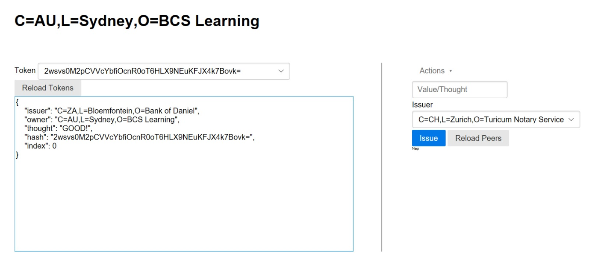

# DGK Bank Frontend

### Introduction: 
- This shows the Frontend of **DGK Bank**.
- Front end of DGk Bank is for requesting and moving tokens in Corda Network.
- Designed for the Administrators of the organizations.

### Getting Started: 
- Adjust the strings at the top of the file to your project 
- And than open index.html 


### Endpoints
All the endpoints given below and the base URL, are constants.


- getTokenEndpoint
```
/dgkbank/getdaniels
```
- getMeEndpoint
```
/dgkbank/myname
```

- getPeersEndpoint
```
/dgkbank/peersnames
```

- postIssueEndpoint
```
/dgkbank/issue-asset-request
```
- postMoveEndpoint
```
/dgkbank/issue-move-request
```

### Installing: 
To get a project running successfully you have to follow the given steps: 
 
##### STEPS- 
 
- Open the page in browser.
- Ensure that you will get frontend page in return. 

### Appearance of Web Page:
Listing of information about what's on the Web page is given below:

**1** The page header is the identity of the node you're connected to.

**2**  The left panel displays tokens this node is aware of.

**3**  The right panel allows you to perform actions on behalf of this node.
       
  3.1  You may issue a new token.
  
  3.2   You may move a token you own to another node. 
  
  


# Requests
- The final requests made to each endpoint (And the functions that stuff.js will call) are specified in endpoints.js.
- There are also a couple of constructors for the data payloads that will head to these requests. 


### Credits: 
[**Daniel Krajnik**](daniel.krajnik@bcstechnology.com.au)


### Acknowledgment: 
- DGK Bank
- [Corda](https://www.corda.net/)


